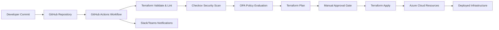

# 🛡️ DevSecOps Infrastructure Pipeline (Terraform + Checkov + OPA)


## 🌟 Overview

This project demonstrates a **complete DevSecOps pipeline** integrating **Infrastructure-as-Code (IaC)**, **Security-as-Code**, and **Continuous Delivery (CD)** practices using Terraform, Checkov, and OPA.

It automates Terraform deployments across multiple environments (`dev`, `preprod`, `prod`) and ensures every infrastructure change is **secure, validated, and compliant** before reaching production.

---

## 🧱 Key Highlights

✅ **Multi-Environment Deployments**

> Separate Terraform backends (`dev`, `preprod`, `prod`) with isolated state files in Azure Blob Storage.

✅ **Automated Security Scans (Checkov)**

> Detects security misconfigurations automatically before deployment.

✅ **Policy-as-Code (OPA/Rego)**

> Enforces rules such as region restrictions, mandatory tags, and no public IPs.

✅ **Manual Approvals for Promotion**

> Controlled deployment flow — `dev` → `preprod` → `prod`.

✅ **CI/CD via GitHub Actions**

> Complete automation from validation → scanning → planning → policy enforcement → apply.

---

## 🧩 Architecture Diagram

### 🌐 Interactive FigJam Diagram

[🔗 View Interactive Diagram on FigJam](https://www.figma.com/file/69099c5336e08191857ff903bcc9f01f?type=whiteboard&node-id=0%3A1)

### 🧠 Mermaid Architecture (GitHub Render)



---

## 📁 Folder Structure

```
enterprise-devsecops-pipeline/
├── infrastructure/
│   └── network/
│       ├── main.tf
│       ├── variables.tf
│       └── outputs.tf
│
├── environments/
│   ├── dev/
│   │   ├── backend.conf
│   │   └── terraform.tfvars
│   ├── preprod/
│   │   ├── backend.conf
│   │   └── terraform.tfvars
│   └── prod/
│       ├── backend.conf
│       └── terraform.tfvars
│
├── policies/
│   ├── opa/
│   │   ├── deny_public_ip.rego
│   │   ├── restrict_location.rego
│   │   └── require_tags.rego
│   └── checkov/
│       └── .checkov.yml
│
└── .github/
    └── workflows/
        └── devsecops.yml
```

---

## ⚙️ Workflow Stages

| Stage         | Description                                  |
| ------------- | -------------------------------------------- |
| 🧹 Validate   | `terraform fmt` + `terraform validate`       |
| 🧹 Lint       | Uses TFLint for best practices               |
| 🛡️ Checkov   | Static code analysis for Terraform           |
| 🔒 OPA (Rego) | Policy enforcement for security & compliance |
| 📊 Plan       | Creates a safe execution plan                |
| ✅ Apply       | Deploys to Azure (after approval)            |

---

## 🧮 Tools Used

| Category         | Tool                | Purpose                          |
| ---------------- | ------------------- | -------------------------------- |
| IaC              | **Terraform**       | Infrastructure provisioning      |
| Security-as-Code | **Checkov**         | Detects insecure configurations  |
| Policy-as-Code   | **OPA (Rego)**      | Custom compliance policies       |
| CI/CD            | **GitHub Actions**  | Automated pipeline orchestration |
| Cloud            | **Microsoft Azure** | Target platform for deployment   |

---

## 🚀 Run Instructions

### 1️⃣ Configure Azure Authentication

Generate a Service Principal and save credentials in GitHub secrets:

```bash
az ad sp create-for-rbac --name "gh-devsecops" --role contributor \
  --scopes /subscriptions/<YOUR_SUBSCRIPTION_ID> \
  --sdk-auth
```

Copy the JSON output and store it under:
**GitHub → Settings → Secrets → Actions → AZURE_CREDENTIALS**

---

### 2️⃣ Trigger the Workflow

From your GitHub repo:

1. Go to **Actions → DevSecOps Multi-Environment Terraform Pipeline**
2. Click **“Run workflow”**
3. Choose environment → `dev`, `preprod`, or `prod`
4. Click **Run**

🛡️ The pipeline will automatically:

* Validate Terraform code
* Run security and OPA checks
* Plan infrastructure
* Await approval before applying

---

## 🔍 Example Policy Violations

| Policy                   | Description                             | Example                              |
| ------------------------ | --------------------------------------- | ------------------------------------ |
| `deny_public_ip.rego`    | Blocks public IPs on network interfaces | `associate_public_ip_address = true` |
| `restrict_location.rego` | Restricts deployments to eastus         | Deploying in `westus`                |
| `require_tags.rego`      | Enforces required resource tags         | Missing `Owner` tag                  |

---

## 🧠 Typical Workflow Execution

1️⃣ **Developer commits Terraform changes**
2️⃣ **GitHub Actions triggers CI/CD**
3️⃣ **Terraform Init → Validate → Plan**
4️⃣ **Security scan via Checkov**
5️⃣ **Policy checks via OPA**
6️⃣ **Approval gate before Apply**
7️⃣ **Deployed securely to Azure**

---

## 🧪 Example Output

```
Checkov Scan Summary:
✅ Passed checks: 28 | ❌ Failed: 0
OPA Evaluation: No policy violations found
Terraform Plan: 2 to add, 0 to change, 0 to destroy
Terraform Apply: Succeeded ✅
```

🧩 This output confirms all resources are deployed securely with no policy violations.

---

## 💼 Why This Project Stands Out

| Feature                            | Value to Recruiters                  |
| ---------------------------------- | ------------------------------------ |
| Full CI/CD Pipeline                | 🔥 Demonstrates automation expertise |
| Security + Policy Integration      | 🛡️ Shows compliance-driven design   |
| Multi-Environment Infra            | 🌎 Enterprise-level scalability      |
| Azure + Terraform + GitHub Actions | 💪 Complete DevSecOps toolchain      |

---

## 👨‍💻 Author

**Sudhir D**
💼 Cloud & DevOps Engineer | Terraform | Azure | DevSecOps
🔗 [GitHub: sudhir81](https://github.com/sudhir81)
📈 [LinkedIn (Add link here)](https://www.linkedin.com/in/sudhir-dalvi-0591a95a/)

